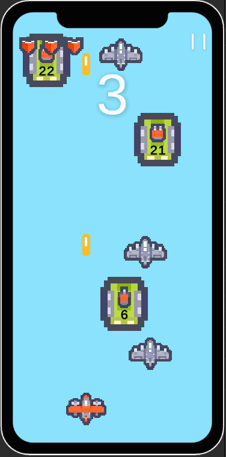
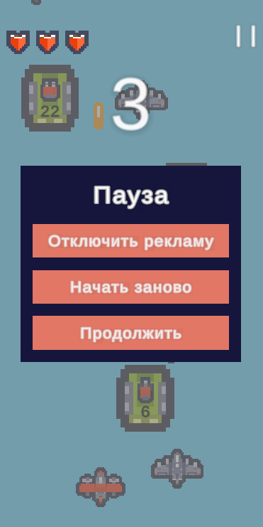
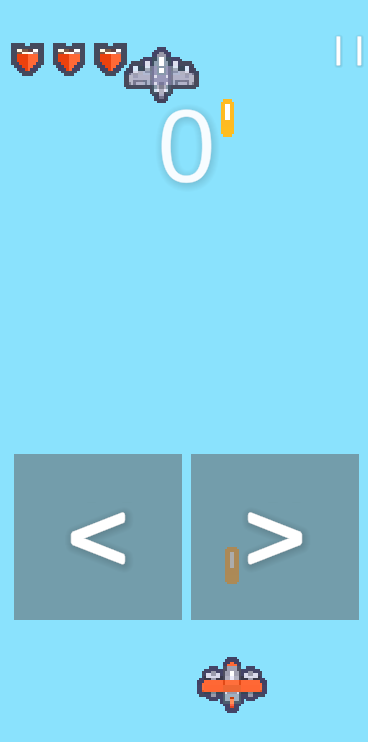

# SKY FORTRESS

Мобильная 2D-аркада на Unity для Android, в которой игрок управляет самолетом, уклоняется от падающих угроз и автоматически расстреливает цели, набирая очки и усиливаясь по ходу забега.

---

## Об игре

Игра запускается в одно касание: после первого нажатия начинается бесконечный поток врагов сверху экрана. Скорость спавна постепенно растёт, поэтому сессия становится всё напряжённее. Базовая цель текущей версии: набрать 10 очков, открыть экран победы и при желании продолжить игру в бесконечном-режиме.

- Жанр: 2D mobile shoot 'em up / arcade survival
- Платформа: Android
- Движок: Unity 6
- Язык: C#
- Режим: одиночная игра

---

## Геймплей

Игрок управляет самолетом в нижней части экрана. Корабль автоматически стреляет вверх, а движение строится вокруг простого мобильного ввода: удержание левой или правой половины экрана двигает персонажа в нужную сторону.

Основной цикл:

- первое касание запускает матч и систему спавна;
- враги появляются сверху;
- по мере игры интервал появления врагов уменьшается;
- за уничтожение врагов начисляются очки;
- при достижении определенного количества очков показывается экран победы;
- после победы можно продолжить игру в бесконечном-режиме.

Если враг сталкивается с игроком, здоровье уменьшается. Когда здоровье заканчивается, открывается экран поражения.



---

## Баффы

В игре есть спавн баффов (усилений). Они появляются вместе с волнами врагов и тоже двигаются сверху вниз. Чтобы активировать бафф, игрок должен расстрелять объект баффа до нуля HP.

Активные баффы:

- усиливают выстрел, переключая снаряд в двойной режим.
- ускоряют стрельбу игрока.
- восстанавливают здоровье.

Сложность баффов тоже масштабируется: их HP растёт по мере прохождения.

---

## Монетизация

Проект ориентирован на мобильную free-to-play модель и содержит 2 базовых сценария монетицазии.

### Рекламные интеграции

После поражения игрок может получить один респавн за просмотр рекламы.

### Покупки в риложении

В интерфейсе предусмотрена возможность платного отключения рекламы.

---

## Интерфейс

В текущей версии игры есть:

- графический интерфейс со счётом;
- полоса здоровья;
- обучающий экран с подсказкой по управлению;
- меню паузы;
- экран поражения;
- экран победы;
- анимация загрузки для сценариев рекламы и покупки.



---

## Управление

- Нажмите на экран, чтобы начать матч.
- Удерживайте левую половину экрана для движения влево.
- Удерживайте правую половину экрана для движения вправо.
- Стрельба выполняется автоматически.
- В правом верхнем углу эерана находится кнопка паузы.

Обучение автоматически скрывается после того, как игрок взаимодействует с левой и правой частью экрана.



---

## Ключевые механики проекта:

- адаптированный под мобильный ввод;
- процедурный спавн врагов и баффов;
- рост сложности через ускорение спавна;
- возможность окончания игры при достижении определенного количества очков или переход в бесконечный режим;
- подготовленные интерфейс и логика для рекламы с вознаграждением и покупки для удаления рекламы.

---

## Структура проекта

```text
Android/
|-- Assets/
|   |-- Data/                   # Данные для UI и тем
|   |-- Prefab/
|   |   |-- Block.prefab
|   |   |-- Bullet.prefab
|   |   |-- GameManager.prefab
|   |   |-- Player.prefab
|   |   |-- Buffs/              # Префабы баффов
|   |   `-- GUI/                # UI-префабы, HP bar и кастомные элементы
|   |-- Resources/
|   |   `-- Shaders/            # Шейдеры и ресурсы для визуальных эффектов
|   |-- Scenes/
|   |   |-- Game.unity          # Основная игровая сцена
|   |   `-- Scene 2.unity       # Тестовая сцена
|   |-- Scripts/
|   |   |-- Block.cs
|   |   |-- GameManager.cs      # Спавн, счёт, состояние игры
|   |   |-- Player.cs           # Движение, стрельба, здоровье, респавн
|   |   |-- Projectile.cs
|   |   |-- UIManager.cs        # Графический игтерфейс
|   |   |-- UITutorial.cs
|   |   `-- GUI/                # Вспомогательные UI-компоненты
|   |-- Settings/               # Шаблонные настройки сцены
|   |-- Sprites/                # Игровые и UI-спрайты
|   |-- TextMesh Pro/
|   `-- InputSystem_Actions.inputactions
|-- Packages/
|   `-- manifest.json           # Зависимости Unity-проекта
|-- ProjectSettings/            # Настройки проекта и платформ
|-- README.md
`-- Assembly-CSharp.csproj
```

---

## Запуск проекта

1. Откройте проект через Unity Hub.
2. Используйте Unity версии 6000.3.5f1.
3. Откройте сцену Assets/Scenes/Game.unity.
4. Нажмите Play в редакторе для локального теста.
5. Для Android-сборки откройте Build Settings и выберите платформу Android.
